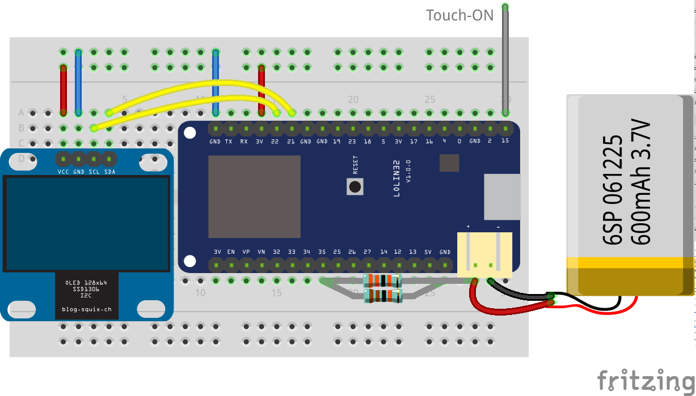
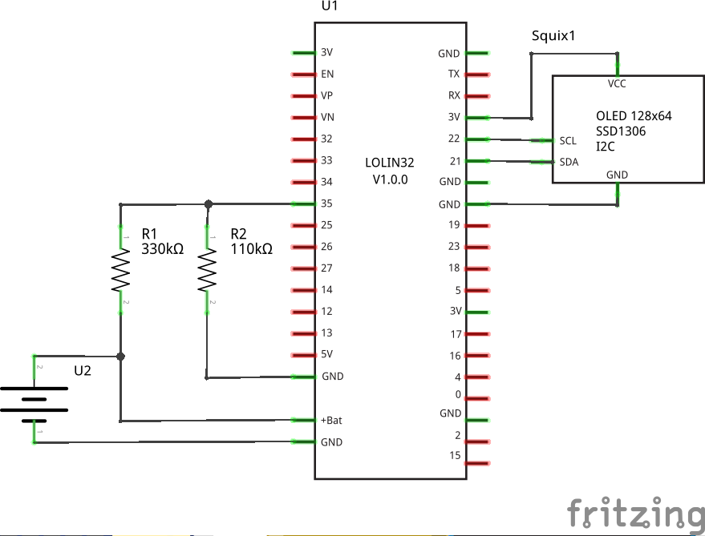

# Komoot Navi Display

Small Bluetooth Low Enegergy (BLE) receiver to display the navigation information from the Komoot app (Android or iPhone).

## Function

The device is switched on by touching sensor pin 15 (default, can be changed in source code). It will show the battery voltage and then try to connect to the Komoot app (navigation in the app should be started befor turning on this BLE receiver). If it can't connect within 30 seconds, it will return to deep sleep.

If the device has connected to the Kommot app, it will show the directions to the next way point as also shown in the app.
At the top it will show the name of the next street. In the middle the direction and the distance to the next junction is shown. The bottom shows the current street name and below the battery voltage bar.

If the device doesn't receive updates from the app for more than 30 seconds (e.g. naviagtion finished or paused), it will turn off (enter deep spleep).

### Pairing the device with the Komoot app

Before using the device as Kommot navigation receiver, it needs to be paired with the Kommot app.
This is done in the app "Profile > Settings > Bluetooth Connect" (not via the system Bluetooth pairing).

Then select "Ciclo HAC bike computer" from the "Connect anaother device" section and turn on the ESP32 navigation receiver.

If the device was discovered ("Ciclo HAC Device &#10004;" shown above the "&#8634; Waiting for connection..."), you are done and need to manually go back to the settings.

## Code

The code was originally developed with Arduino IDE, but then I changed to PlatformIO (on  VS Code or Atom editor) due to better integration with Git, faster code complilation and good dependency management for teh libraries.

The display orientation can be rotated by the value of the “rotation” variable in the code.

### Development

In PlatformIO the “Expressif 32” platform needs to be installed. The additional libraries “ESP32 BLE Arduino” for the Bluetooth Low Energy support and “U8g2” for the display driver are automatically loaded via the dependencies defined in the [platformio.ini](/platformio.ini) file.

The symbols have been converted and edited with Gimp to the required XBM format. For the navigation symbols I used the nav-icons provided in PNG format on the Komoot BLE Github [[1]](#References). The down-sizing required some manual corrections for smooth edges. I copied the xmb files in two C-libraries, one for the nav-icons and the second for some extra symbols.

## Circuit

The device was tested with a [Wemos Lolin32](https://wiki.wemos.cc/products:lolin32:lolin32) and the slightly smaller [Wemos Lolin32 lite](https://wiki.wemos.cc/products:lolin32:lolin32_lite), both can still be purchased on Ebay or similar. For the display an OLED 128x64 is used with either [0.96" (SSD1306 controller)](https://www.ebay.de/itm/0-96-I2C-IIC-Serial-128X64-128-64-White-OLED-LCD-LED-Display-Module-for-Arduino/122680684215) or [1.3" (SSD1106 controller)](https://www.ebay.de/itm/White-1-3-OLED-LCD-Display-Module-IIC-I2C-Interface-128x64-3-5V-For-Arduino/272827722582) size. The unit is powered with a 3.7 V LiPo battery.

A voltage devider with two resistors is used to measure the battery power. The battery level is shown with a bar indicator at the bottom of the display and the device turns off (deep sleep) if the power is too low.

Breadboard wiring:

Schematic:

The [Fritzing](https://fritzing.org) source file: [Komoot_BLE](Komoot_BLE.fzz)

### Components

* ESP32 board, e.g. LOLIN32 or Lolin32 lite (clones still available on Ebay)
* OLED display 128x64 with SH1106 or SSD1306 controller
* LiPo battery 3.7 V, 600 mAh (maybe a 150 mAh is sufficient)

## References

1. Komoot BLE specification: [komoot/BLEConnect](https://github.com/komoot/BLEConnect)
2. PlatformIO [ESP32](http://docs.platformio.org/en/latest/platforms/espressif32.html)
3. Neil Kolban's [BLRexample file](https://github.com/nkolban/ESP32_BLE_Arduino)
4. Adreas Spiess Polar receiver [video #174](https://youtu.be/osneajf7Xkg)
5. Similar (newer) project [esp32_komoot_ble](https://github.com/jstiefel/esp32_komoot_ble)
